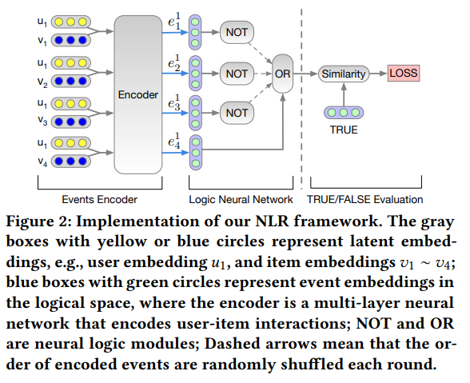
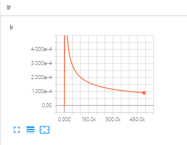
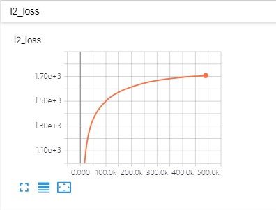

# An Implementation of NLR: [Neural Collaborative Reasoning](https://arxiv.org/abs/2005.08129)
----------

This isn't an official code. I tried to implement the paper as I understood.

## The basic idea of the paper 

The paper propose a Modularized Logical Neural Network architecture, which learns basic logical operations 
such as AND, OR, and NOT as neural modules based on logical regularizer, and learns logic variables 
as vector embeddings. In this way, each logic expression can be equivalently organized as a 
neural network, so that logical reasoning and prediction can be conducted in a continuous space. 



## Requirements

- python3
- numpy
- tqdm
- tensorflow==1.11.0

> Maybe the version of tensorflow doesn't matter a lot, and I have not tested.

## Training

- First. Run the command below to download Movielens-100K dataset.
```shell script
cd dataset
bash download.sh
```

- Second. Run the command below to preprocess data.
```shell script
python data_preprocess.py
```

- Then. Run the following command to train model.
```shell script
python train.py
```
Also you can change the default hyper-parameters by 2 ways. 
One is modifying the `hyper_params.py` file.
And the other is like following.
```shell script
python train.py --user_emb_dim 128 \
                --item_emb_dim 128 \
                --hidden1_dim 256 \
                --hidden2_dim 128 \
                --batch_size 64 \
                --lr 0.001 \
                --num_epochs 20
```

After that you can see logs are printed. Also the tensorboard.

- Tensorboard curve

       
    

## Test
- Run
```shell script
# python test.py --ckpt model_ckpt/test1/{your_model_name}
# example
python test.py --ckpt model_ckpt/test1/nlr-13500
```

Then, you can see the log below.
```shell script
top10 accuracy: 0.021208907741251327
NDCG@10: 0.01156174343312406
```

***Some hyper-parameter wasn't mentioned in paper, and now I'm tuning. 
The results may be not satisfying.***

## Note

- adding fast searching strategy, making inference faster.

- some unconspicuous details.

> Please offer your questions and suggestions by writing issues or sending email to 406493851@qq.com, so that I can improve it.
